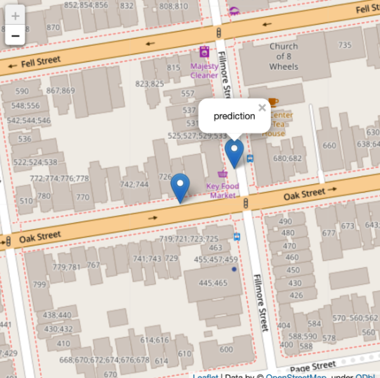

# Cab Spotting - CO2 Reduction Potential and Passenger Prediction

### NbViewer Links:
1. [EDA - Temporal Heatmaps](https://nbviewer.org/github/Shivam-Miglani/cabspotting_pmi/blob/main/notebooks/00_EDA_preprocessing.ipynb) | 2. [CO2 reduction](https://nbviewer.org/github/Shivam-Miglani/cab_data_analysis/blob/main/notebooks/01_CO2_reduction.ipynb) | 3. [Passenger Prediction](https://nbviewer.org/github/Shivam-Miglani/cab_data_analysis/blob/main/notebooks/02_passenger_prediction.ipynb) | 4. [Cab Clusters](https://nbviewer.org/github/Shivam-Miglani/cab_data_analysis/blob/main/notebooks/03_cab_clusters.ipynb)

### Description
The repo contains four notebooks:

1. `00_EDA_preprocessing.ipynb`: The notebook states the business objectives and contains basic EDA and preprocessing of dataset.
   1. Notebook plots **interactive temporal heatmaps** to visualize cabtrails throughout the time period
   
   
   2. Notebook plots fraction of empty cabs
   
2. `01_CO2_reduction.ipynb`: The notebook explores the first task of estimating yearly CO2 emission reduction caused due to unoccupied cabs.
   1. The notebook explores how to calculate the `distance` (vectorized haversine) between two coordinates
   2. Does more advanced EDA with trip duration and distances, ultimately finds and removes outliers
     - remove cabs with very high (or low) speeds
   3. States assumptions made and calculates the potential CO2 estimates (wheel and well-to-wheel estimates).
   
   
3. `02_passenger_prediction.ipynb`: Notebook takes the processed data and builds a model for taxi drivers to predict location of next passengers.
   1. Feature Engineering
      - time-based, location based and previous trip based features
   2. Very fast **hist gradient boosting model**, which can even be used for online training to do live predictions!
   3. Prediction example
      
      
   4. MLOps demonstration
      - weights & biases dashboard with
4. `03_cab_clusters.ipynb`: This notebook attempts to find cab clusters using ML and domain knowledge.
   1. Uses advanced geoplotting to visualize the solution (notebook 0.)
   2. Segregates profit-making, under-utilized, efficient and liability cab drivers

